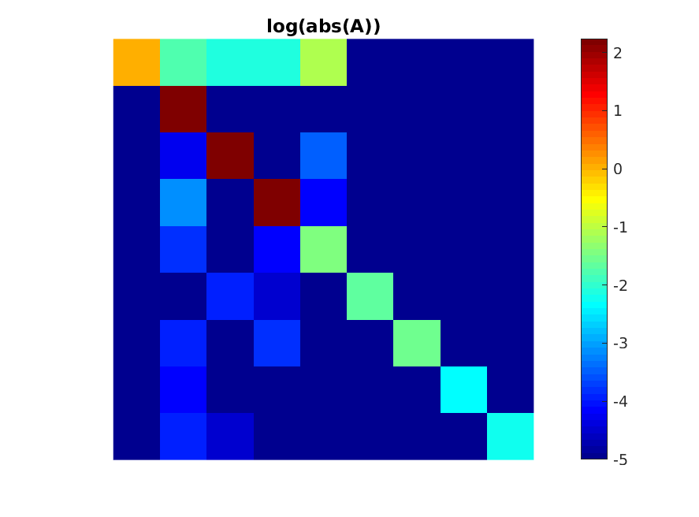

# B0 shimming 


##  Goal

To provide an alternative to the scanner's built-in B0 shimming routine,
so that the linear and high-order B0 shims can be set according to well-defined 
(and potentially application-specific) critera.
For example, the user may want to:
1. Minimize root-mean-square (RMS) B0 inhomogeneity over a user-specified 3D subvolume.
1. Minimize the maximum through-voxel B0 gradient, to reduce signal loss in T2\*-weighted imaging.

To do this we define the system shim model
```
   f(s) = H*A*s + f(s=0)         
   f:  [N 1]              fieldmap (Hz), where N = number of voxels
   H:  [N nShim]          spherical harmonic basis (see getSHbasis.m)
   A:  [nShim nShim]      calibration matrix
   s:  [nShim 1]          shim current amplitudes (hardware units)
```
where `f(s=0)` is the observed B0 field map when all shim currents are set to zero.
For 2nd order shim systems (e.g., GE MR750), we have
```
   nShim = 9
   H = [1 x y z z2 xy zx x2-y2 zy] 
```
where each term in `H` is an `[N 1]` vector, evaluated at the same `N` spatial locations as `f`. 
The first column corresponds to the DC (spatially invariant) offset.

The goal here is to set the shim current vector `s` to make `f(s)` as homogeneous
as possible -- or more generally, to choose `s` according to some desired property of `f`
such as minimizing roughness or the maximum through-voxel gradient.

To do this we need to first **calibrate** the shim system to obtain `A`.


## Shim calibration (obtaining A)

We obtain `A` by turning the shims on/off one-by-one and acquiring a 3D fieldmap for each shim setting.
This can be done in a stationary phantom, and only needs to be done once for each scanner.

We then obtain `A` as follows:
```
   F = HAS
   F: [N nShim]                          fieldmaps (Hz) obtained by turning on individual shim coils
   S: [nShim nShim]                      applied shim amplitudes
   mask: [N 1]                           binary mask (object support)
   W = diag_sp(mask(:));
   A = inv(H'*H)*H'*F*inv(S);            [nShim nShim] 
```

Example:
```
>> % reconstruct unwrapped field maps F = [nx ny nz 8], obtained with shim settings S = [8 8]
>> nx = 64; ny = 64; nz = 30;                              % fieldmap matrix size
>> FOV = [20 20 10];                                       % fieldmap FOV (cm) 
>> [X,Y,Z] = getgrid(nx,ny,nz,FOV);                        % [nx ny nz], in same units as FOV
>> % define mask = [nx ny nz] (object support)
>> H = getSHbasis(X(mask),Y(mask),Z(mask),2);              % [N 9] where N = numel(X(mask))
>> % similarly, mask F and reshape to [N 8]
>> % form 8x8 matrix S containing (pairwise differences in) shim currents used to obtain F
>> A = getcalmatrix(F, H, S);
```

`A` will be close to diagonal.
As an example, here is the calibration matrix obtained on a GE 3T scanner:



## How to perform 2nd order shimming

```
  >> nx = 64; ny = 64; nz = 30;                    % fieldmap matrix size
  >> FOV = [20 20 10];                             % fieldmap FOV (cm) 
  >> [X,Y,Z] = getgrid(nx,ny,nz,FOV);              % [nx ny nz], in same units as FOV
  >> H = getSHbasis(X(),Y(mask),Z(mask),2);              % [N 9] where N = numel(X(mask))
  >> % Obtain H as described above
  >> W = diag_sp(mask(:));                         % Alternatively, W can be non-binary weight
  >> % load A
  >> s = -(W*H*A)\(W*f(mask)); 
  >> s = round(s);      % scanner hardware uses integer units
```

1. Acquire fieldmap with ../psd/Cartesian/
1. Reconstruct UNWRAPPED fieldmap 'fmap' ([nx ny nz])
1. Calculate shim amplitudes and create the file 'newshims.atp':
```
>> s = getshims(fmap, A, seq, mask);
```
1. Copy 'newshims.atp' to scanner and apply shims.
```
$ atp newshims.atp 
```
1. Set scanner center frequency to the value of s(1).  **TODO:** add B0 offset to atp file
1. (optional) Acquire fieldmap again and compare with predicted field map (the figure produced by getshims).


## Test the scripts

```
>> addpath ..
>> seq = getparams();
>> A = getcalmatrix('test',seq)
>> s = getshims('test',A,seq)
```


