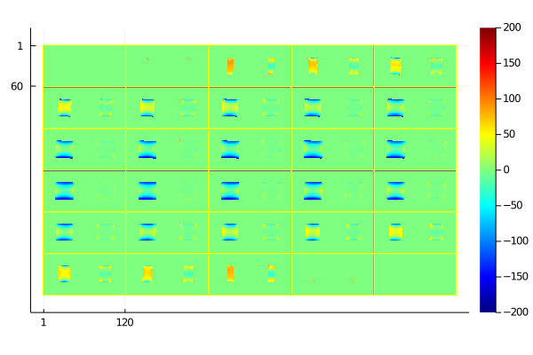

# An open toolbox for B0 shimming 

##  Goal

To provide an alternative to the scanner's built-in B0 shimming routine,
so that the linear and high-order B0 shims can be set according to well-defined 
(and potentially application-specific) critera.

The framework allows for nonlinear loss functions, and may be useful for exploring alternative shimming criteria (beyond least-squares) in the future. 
For example, the user may want to minimize root-mean-square (RMS) B0 inhomogeneity over a user-specified 3D subvolume.

We envision this tool as one component of a more harmonized cross-vendor MRI workflow in support of **reproducible MRI research**.


## Quick start

1. Get this toolbox
```
$ git clone git@github.com:HarmonizedMRI/B0shimming.git
```

2. Change into the `julia` subdirectory
```
julia> cd("julia")
```

3. Start Julia (download from https://julialang.org/). Current version is 1.6.0.

4. Press `]` to enter the Julia package manager and do:
```
(@v1.6) pkg> activate .
(julia) pkg> instantiate
```

5. Press `backspace` to get back to the Julia prompt.

6. Run the example:
```
julia> include("example.jl")
```

Each panel in the output image shows the field map (in Hz) before (left) and 
after (right) 2nd order shimming of a cylindrical jar phantom:



## Description

The code is based on the model
```
f(s) = H*A*s + f0         
f:  [N]          fieldmap (Hz), where N = number of voxels
f0: [N]          observed 'baseline' field map, e.g., after setting all shim currents to zero
H:  [N nb]       spherical harmonic basis (see julia/getSHbasis.jl). nb = # of basis functions.
A:  [nb nb]      shim coil expansion coefficients for basis in H (see julia/getcalmatrix.jl)
s:  [nShim+1]    change in center frequency (cf) and shim currents from baseline (hardware units)
```
For 2nd order shim systems, nShim = 8 (3 linear and 5 2nd order).  
Each column in `H` is an `N`-vector, evaluated at the same `N` spatial locations as `f`. 
The first column corresponds to the center frequency offset.
This toolbox provides support for spherical harmonic basis functions of arbitrary order
(see julia/getSHbasis.jl), but the code should work equally well with other bases.

The goal here is to set the shim current vector `s` to make `f(s)` as homogeneous
as possible -- or more generally, to choose `s` according to some desired property of `f`
such as minimizing roughness or the maximum through-voxel gradient.

To do this we need to first **calibrate** the shim system to obtain `A`,
which contains the basis expansion coefficients for a particular shim system.
We do this by turning the shims on/off one-by-one and acquiring a 3D fieldmap for each shim setting,
and assembling that data into a matrix `F`:
```
F: [N nShim]       fieldmaps (Hz) obtained by turning on/off individual shim coils
S: [nShim nShim]   applied shim currents (pairwise differences) used to obtain F
```
`F` should be obtained in a stationary phantom, and only needs to be acquired once for each scanner.
We then obtain `A` by fitting each column in `F`
to the basis in `H`, using least-squares fitting (backslash in Julia); see julia/getcalmatrix.jl.

See `julia/example.jl` for a complete example, and additional information for how to construct F.


## Cite

*Jon-Fredrik Nielsen, Berkin Bilgic, Jason P. Stockmann, Borjan Gagoski, 
Jr-Yuan George Chiou, Jr, Lipeng Ning, Yang Ji, Yogesh Rathi, 
Jeffrey A. Fessler, Douglas C. Noll, and Maxim Zaitsev.
An open toolbox for harmonized B0 shimming.
Proc. Intl. Soc. Mag. Reson. Med. 2021; 3772.*
