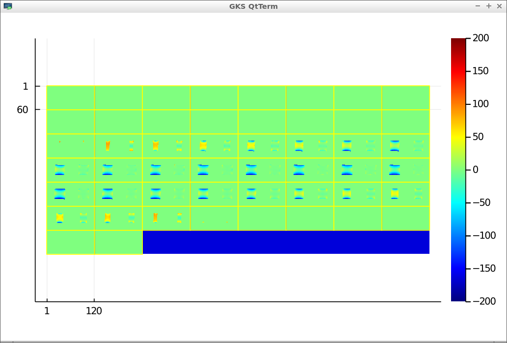

# An open toolbox for B0 shimming 

##  Goal

To provide an alternative to the scanner's built-in B0 shimming routine,
so that the linear and high-order B0 shims can be set according to well-defined 
(and potentially application-specific) critera.
For example, the user may want to minimize root-mean-square (RMS) B0 inhomogeneity 
over a user-specified 3D subvolume.


## Quick start

1. Start Julia (download from https://julialang.org/)
2. Press `]` to enter the Julia package manager and do:
```
(@v1.5) pkg> activate .
(@v1.5) pkg> instantiate
```
3. Press `backspace` to get back to the Julia prompt.
4. Run the example:
```
julia> cd("julia")
julia> include("example.jl")
```
(When running the first time, precompilation is needed which takes a few minutes.)  
Each panel in the output image shows the field map (in Hz) before (left) and 
after (right) 2nd order shimming of a cylindrical jar phantom:



## Description

The code is based on the model
```
f(s) = H*A*s + f0         
f:  [N 1]        fieldmap (Hz), where N = number of voxels
f0: [N 1]        observed 'baseline' field map, e.g., after setting all shim currents to zero
H:  [N nb]       spherical harmonic basis (see julia/getSHbasis.jl). nb = number of basis functions.
A:  [nb nb]      shim coil expansion coefficients for basis in H (see julia/getcalmatrix.jl)
s:  [nShim+1 1]  change in center frequency (cf) and shim currents from baseline (hardware units)
```
For 2nd order shim systems, nShim = 8 (3 linear and 5 2nd order).  
Each term in `H` is an [N 1] vector, evaluated at the same `N` spatial locations as `f`. 
The first column corresponds to the center frequency offset.

The goal here is to set the shim current vector `s` to make `f(s)` as homogeneous
as possible -- or more generally, to choose `s` according to some desired property of `f`
such as minimizing roughness or the maximum through-voxel gradient.

To do this we need to first **calibrate** the shim system to obtain `A`.
We do this by turning the shims on/off one-by-one and acquiring a 3D fieldmap for each shim setting,
and assembling that data into a matrix `F`.
This can be done in a stationary phantom, and only needs to be done once for each scanner.
We then obtain `A` as follows (see also julia/getcalmatrix.jl):
```
A = inv(H'*H)*H'*F*inv(S);   [nb nb] Includes cf offset term.
```
where
```
F = HAS
F: [N nShim]       fieldmaps (Hz) obtained by turning on/off individual shim coils
S: [nShim nShim]   applied shim currents (pairwise differences) used to obtain F
```
See `julia/example.jl` for a complete example, and additional information for how to construct F.


