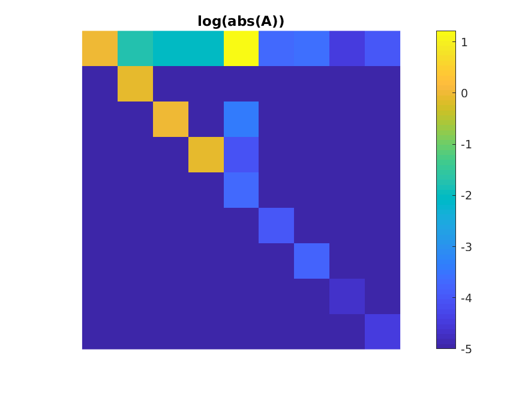

# An open toolbox for B0 shimming 


##  Goal

To provide an alternative to the scanner's built-in B0 shimming routine,
so that the linear and high-order B0 shims can be set according to well-defined 
(and potentially application-specific) critera.
For example, the user may want to:
1. Minimize root-mean-square (RMS) B0 inhomogeneity over a user-specified 3D subvolume.
1. Minimize the maximum through-voxel B0 gradient, to reduce signal loss in T2\*-weighted imaging.

To do this we define the system shim model
```
f(s) = H*A*s + f0         
f:  [N 1]              fieldmap (Hz), where N = number of voxels
f0: [N 1]              observed 'baseline' field map, e.g., after setting all shim currents to zero
H:  [N nShim]          spherical harmonic basis (see getSHbasis.m)
A:  [nShim nShim]      calibration matrix
s:  [nShim 1]          change in shim current amplitudes from baseline (hardware units)
```
For 2nd order shim systems (e.g., GE MR750), we have
```
nShim = 9
H = [1 x y z z2 xy zx x2-y2 zy]
```
where each term in `H` is an `[N 1]` vector, evaluated at the same `N` spatial locations as `f`. 
The first column corresponds to the DC (spatially invariant) offset.

The goal here is to set the shim current vector `s` to make `f(s)` as homogeneous
as possible -- or more generally, to choose `s` according to some desired property of `f`
such as minimizing roughness or the maximum through-voxel gradient.

To do this we need to first **calibrate** the shim system to obtain `A`.


## Shim calibration (obtaining A)

We obtain `A` by turning the shims on/off one-by-one and acquiring a 3D fieldmap for each shim setting.
This can be done in a stationary phantom, and only needs to be done once for each scanner.
We then obtain `A` as follows:
```
F = HAS
F: [N nShim]                          fieldmaps (Hz) obtained by turning on/off individual shim coils
S: [nShim nShim]                      applied shim currents (pairwise differences) used to obtain F
A = inv(H'*H)*H'*F*inv(S);            [nShim nShim] 
```

Example: ./examples/demoWLS.m  

As an example, here is the calibration matrix obtained on a GE 3T scanner:



## How to perform 2nd order shimming

See also ./examples/demoWLS.m.

1. Acquire a baseline fieldmap `f0`. This does not need to use the same matrix size or FOV as the calibration scan.
2. Define a binary `mask` (control points), and reshape `f0` to `[N 1]` where `N = numel(X(mask))`
3. Construct the basis `H` on the control points, e.g.,
```
  >> nx = 64; ny = 64; nz = 20;                    % fieldmap matrix size
  >> FOV = [20 20 10];                             % fieldmap FOV (cm) 
  >> [X,Y,Z] = getgrid(nx,ny,nz,FOV);              % [nx ny nz], in same units as FOV
  >> H = getSHbasis(X(mask),Y(mask),Z(mask),2);    % [N 9] where N = numel(X(mask))
```
4. Load the calibration matrix `A`.
5. Apply the model `f = HAs + f0` and solve for `s` according to your desired loss function.
For example, to minimize the weighted RMS B0 field the Matlab solution is

```
  >> s = -(W*H*A)\(W*f0); 
```
where `W` is a diagonal spatial weighting matrix.


## Demo the code

```
>> cd examples;
>> demoWLS;
```

